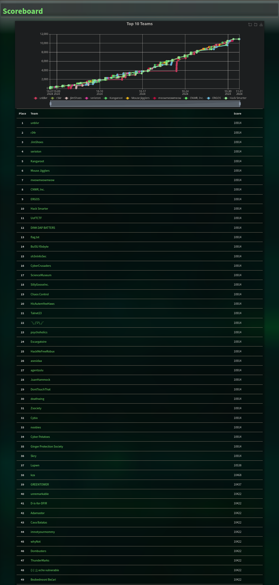
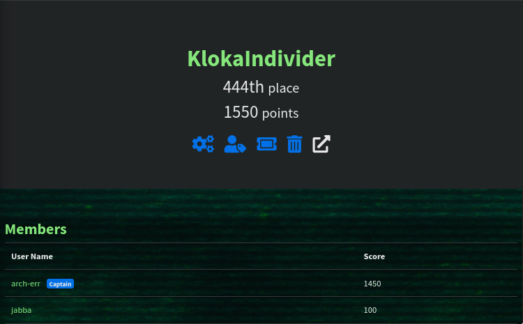

# HuntressCTF-2024
- https://huntress.ctf.games/challenges

## Description
*Celebrate Cybersecurity Awareness Month with Huntress   |   New challenges released every day!*

**October 1, 12:00 PM PT - November 1, 12:00 PM PT**

# Results
**Username:** arch-err

**Team:** KlokaIndivider

**Flags:** (20/66)

# Challenges
- [x] [Zulu](Zulu)
- [x] [Typo](Typo)
- [x] [I_Can't_SSH](I_Can't_SSH)
- [x] [Unbelievable](Unbelievable)
- [x] [TXT_Message](TXT_Message)
- [x] [Whamazon](Whamazon)
- [x] [Too_Many_Bits](Too_Many_Bits)
- [x] [Technical_Support](Technical_Support)
- [x] [Cattle](Cattle)
- [x] [Read_The_Rules](Read_The_Rules)
- [x] [MatryoshkaQR](MatryoshkaQR)
- [x] [Mystery](Mystery)
- [x] [Finders_Fee](Finders_Fee)
- [x] [The_Void](The_Void)
- [ ] [MOVEable](MOVEable)
- [ ] [Plantopia](Plantopia)
- [ ] [HelpfulDesk](HelpfulDesk)
- [x] [Y2J](Y2J)
- [ ] [Baby_Buffer_Overflow_-_32bit](Baby_Buffer_Overflow_-_32bit)
- [ ] [GoCrackMe3](GoCrackMe3)
- [ ] [GoCrackMe2](GoCrackMe2)
- [ ] [OceanLocust](OceanLocust)
- [ ] [Stack_It](Stack_It)
- [ ] [GoCrackMe1](GoCrackMe1)
- [x] [Strive_Marish_Leadman_TypeCDR](Strive_Marish_Leadman_TypeCDR)
- [x] [No_need_for_Brutus](No_need_for_Brutus)
- [ ] [Backdoored_Splunk_II](Backdoored_Splunk_II)
- [ ] [Keyboard_Junkie](Keyboard_Junkie)
- [ ] [Hidden_Streams](Hidden_Streams)
- [x] [Zimmer_Down](Zimmer_Down)
- [x] [Obfuscation_Station](Obfuscation_Station)
- [ ] [Ping_Me](Ping_Me)
- [ ] [Rustline](Rustline)
- [ ] [eepy](eepy)
- [ ] [Eco-Friendly](Eco-Friendly)
- [ ] [X-RAY](X-RAY)
- [ ] [Strange_Calc](Strange_Calc)
- [ ] [Mimi](Mimi)
- [ ] [Russian_Roulette](Russian_Roulette)
- [ ] [Discount_Programming_Devices](Discount_Programming_Devices)
- [ ] [Time_will_tell](Time_will_tell)
- [ ] [Permission_to_Proxy](Permission_to_Proxy)
- [ ] [System_Code](System_Code)
- [ ] [1200_Transmissions](1200_Transmissions)
- [ ] [Sekiro](Sekiro)
- [ ] [Red_Phish_Blue_Phish](Red_Phish_Blue_Phish)
- [x] [Malibu](Malibu)
- [ ] [Linux_Basics](Linux_Basics)
- [ ] [Base-p-](Base-p-)
- [ ] [Echo_Chamber](Echo_Chamber)
- [ ] [Base64by32](Base64by32)
- [ ] [Ran_Somewhere](Ran_Somewhere)
- [ ] [More_Challenges_Tomorrow!](More_Challenges_Tomorrow!)
- [ ] [Little_Shop_of_Hashes](Little_Shop_of_Hashes)
- [ ] [Nightmare_on_Hunt_Street](Nightmare_on_Hunt_Street)
- [ ] [Ancient_Fossil](Ancient_Fossil)
- [ ] [Zippy](Zippy)
- [ ] [PillowFight](PillowFight)
- [ ] [In_Plain_Sight](In_Plain_Sight)
- [ ] [Rusty_Bin](Rusty_Bin)
- [ ] [Thats_Life](Thats_Life)
- [ ] [Knights_Quest](Knights_Quest)
- [ ] [Palimpsest](Palimpsest)
- [ ] [Revenge_of_Discount_Programming_Devices](Revenge_of_Discount_Programming_Devices)
