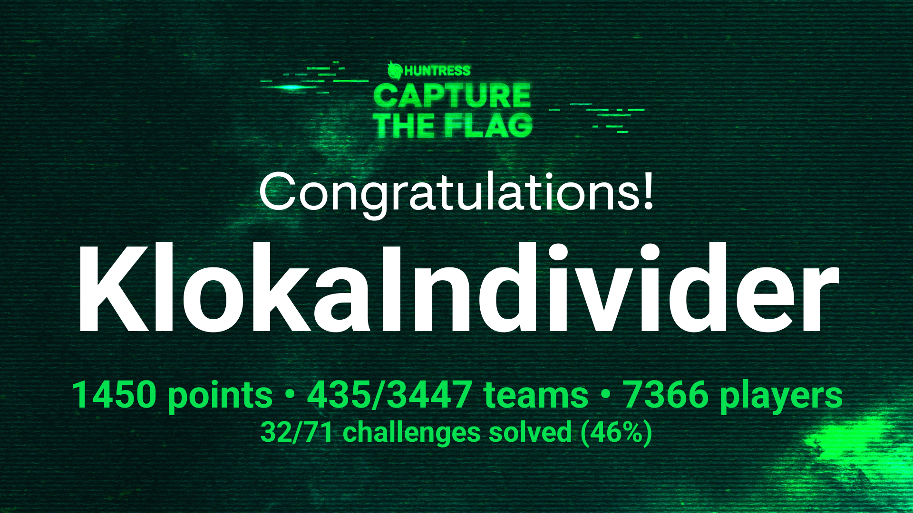
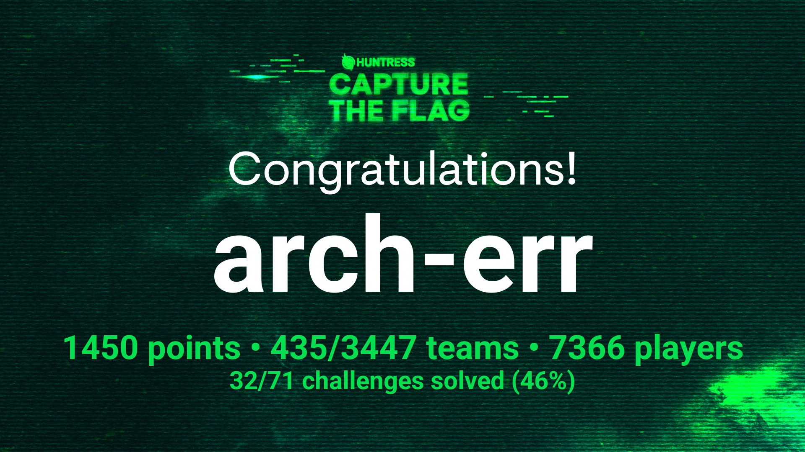

# HuntressCTF-2024
- https://huntress.ctf.games/challenges

## Description
*Celebrate Cybersecurity Awareness Month with Huntress   |   New challenges released every day!*

**October 1, 12:00 PM PT - November 1, 12:00 PM PT**

# Results
**Username:** arch-err

**Team:** KlokaIndivider

**Flags:** (20/66)

# Challenges

## Warmups
- [x] [Zulu](challenges/Zulu)
- [x] [Typo](challenges/Typo)
- [x] [I_Can't_SSH](challenges/I_Can't_SSH)
- [x] [Unbelievable](challenges/Unbelievable)
- [x] [TXT_Message](challenges/TXT_Message)
- [x] [Whamazon](challenges/Whamazon)
- [x] [Too_Many_Bits](challenges/Too_Many_Bits)
- [x] [Technical_Support](challenges/Technical_Support)
- [x] [Cattle](challenges/Cattle)
- [x] [Read_The_Rules](challenges/Read_The_Rules)
- [x] [MatryoshkaQR](challenges/MatryoshkaQR)
- [x] [Finders_Fee](challenges/Finders_Fee)
- [x] [The_Void](challenges/The_Void)
- [x] [Mystery](challenges/Mystery)

## Web
- [ ] [Zippy](challenges/Zippy)
- [ ] [MOVEable](challenges/MOVEable)
- [ ] [PillowFight](challenges/PillowFight)
- [ ] [Plantopia](challenges/Plantopia)
- [ ] [HelpfulDesk](challenges/HelpfulDesk)
- [x] [Y2J](challenges/Y2J)

## Binary Exploitation
- [ ] [Baby_Buffer_Overflow_-_32bit](challenges/Baby_Buffer_Overflow_-_32bit)

## Reverse Engineering
- [ ] [In_Plain_Sight](challenges/In_Plain_Sight)
- [ ] [Rusty_Bin](challenges/Rusty_Bin)
- [ ] [Thats_Life](challenges/Thats_Life)
- [ ] [GoCrackMe3](challenges/GoCrackMe3)
- [ ] [GoCrackMe2](challenges/GoCrackMe2)
- [ ] [OceanLocust](challenges/OceanLocust)
- [ ] [Knights_Quest](challenges/Knights_Quest)
- [ ] [Stack_It](challenges/Stack_It)
- [ ] [GoCrackMe1](challenges/GoCrackMe1)

## Cryptography
- [x] [Strive_Marish_Leadman_TypeCDR](challenges/Strive_Marish_Leadman_TypeCDR)
- [x] [No_need_for_Brutus](challenges/No_need_for_Brutus)

## Forensics
- [ ] [Ancient_Fossil](challenges/Ancient_Fossil)
- [ ] [Backdoored_Splunk_II](challenges/Backdoored_Splunk_II)
- [ ] [Keyboard_Junkie](challenges/Keyboard_Junkie)
- [ ] [Hidden_Streams](challenges/Hidden_Streams)
- [x] [Zimmer_Down](challenges/Zimmer_Down)
- [x] [Obfuscation_Station](challenges/Obfuscation_Station)

## Malware
- [ ] [Rustline](challenges/Rustline)
- [ ] [Palimpsest](challenges/Palimpsest)
- [ ] [Revenge_of_Discount_Programming_Devices](challenges/Revenge_of_Discount_Programming_Devices)
- [ ] [eepy](challenges/eepy)
- [ ] [Eco-Friendly](challenges/Eco-Friendly)
- [ ] [Ping_Me](challenges/Ping_Me)
- [ ] [X-RAY](challenges/X-RAY)
- [ ] [Strange_Calc](challenges/Strange_Calc)
- [ ] [Mimi](challenges/Mimi)
- [ ] [Russian_Roulette](challenges/Russian_Roulette)
- [ ] [Discount_Programming_Devices](challenges/Discount_Programming_Devices)

## Miscellaneous
- [ ] [Permission_to_Proxy](challenges/Permission_to_Proxy)
- [ ] [System_Code](challenges/System_Code)
- [ ] [Time_will_tell](challenges/Time_will_tell)
- [ ] [1200_Transmissions](challenges/1200_Transmissions)
- [ ] [Sekiro](challenges/Sekiro)
- [ ] [Red_Phish_Blue_Phish](challenges/Red_Phish_Blue_Phish)
- [x] [Malibu](challenges/Malibu)
- [ ] [Linux_Basics](challenges/Linux_Basics)
- [ ] [Base-p-](challenges/Base-p-)

## Scripting
- [ ] [Echo_Chamber](challenges/Echo_Chamber)
- [ ] [Base64by32](challenges/Base64by32)

## OSINT
- [ ] [Ran_Somewhere](challenges/Ran_Somewhere)

## Challenge Group
- [ ] [Little_Shop_of_Hashes](challenges/Little_Shop_of_Hashes)
- [ ] [Nightmare_on_Hunt_Street](challenges/Nightmare_on_Hunt_Street)
