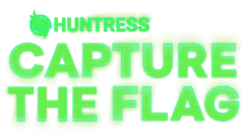

# HuntressCTF-2024
- https://huntress.ctf.games/challenges

## Description
*Celebrate Cybersecurity Awareness Month with Huntress | New challenges released every day!*

# Results
**Username:** arch-err

**Team:** KlokaIndivider

**Flags:** (0/55)

# Challenges
- [ ] Zulu
- [ ] Typo
- [ ] I_Can't_SSH
- [ ] Unbelievable
- [ ] TXT_Message
- [ ] Whamazon
- [ ] Too_Many_Bits
- [ ] Technical_Support
- [ ] Cattle
- [ ] Read_The_Rules
- [ ] MatryoshkaQR
- [ ] Mystery
- [ ] Finders_Fee
- [ ] The_Void
- [ ] MOVEable
- [ ] Plantopia
- [ ] HelpfulDesk
- [ ] Y2J
- [ ] Baby_Buffer_Overflow_-_32bit
- [ ] GoCrackMe3
- [ ] GoCrackMe2
- [ ] OceanLocust
- [ ] Stack_It
- [ ] GoCrackMe1
- [ ] Strive_Marish_Leadman_TypeCDR
- [ ] No_need_for_Brutus
- [ ] Backdoored_Splunk_II
- [ ] Keyboard_Junkie
- [ ] Hidden_Streams
- [ ] Zimmer_Down
- [ ] Obfuscation_Station
- [ ] Ping_Me
- [ ] Rustline
- [ ] eepy
- [ ] Eco-Friendly
- [ ] X-RAY
- [ ] Strange_Calc
- [ ] Mimi
- [ ] Russian_Roulette
- [ ] Discount_Programming_Devices
- [ ] Time_will_tell
- [ ] Permission_to_Proxy
- [ ] System_Code
- [ ] 1200_Transmissions
- [ ] Sekiro
- [ ] Red_Phish_Blue_Phish
- [ ] Malibu
- [ ] Linux_Basics
- [ ] Base-p-
- [ ] Echo_Chamber
- [ ] Base64by32
- [ ] Ran_Somewhere
- [ ] More_Challenges_Tomorrow!
- [ ] Little_Shop_of_Hashes
- [ ] Nightmare_on_Hunt_Street
